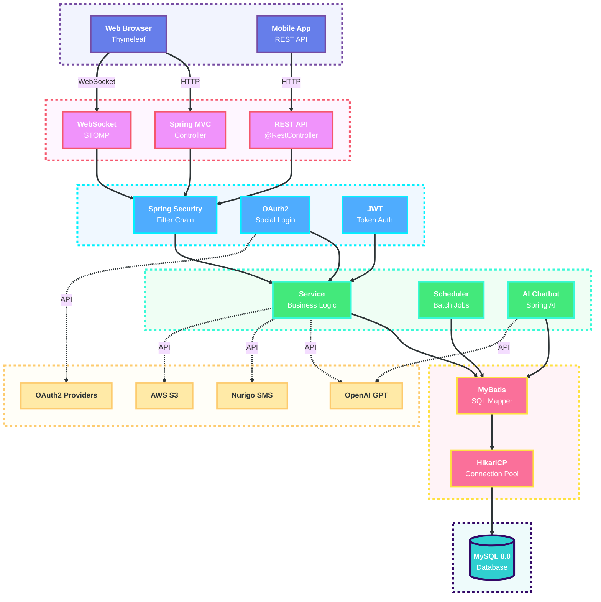

<a id="top"></a>
<div align="center">


<br/>

### 이웃과 함께 성장하는 커뮤니티 플랫폼

<br/>

[](https://git.io/typing-svg)

<br/>

[](https://spring.io/projects/spring-boot)
[](https://www.oracle.com/java/)
[](https://www.mysql.com/)
[](https://mybatis.org/)
[](https://spring.io/projects/spring-security)
[](https://stomp.github.io/)

</div>

---
<br/><br/>

## 📖 프로젝트 개요

<div align="center">

### "당신의 이웃이 당신의 친구가 되는 순간"

</div>

<br/>

**NEIGHBUS**는 기술을 통해 이웃 간의 단절을 해결하고, 오프라인 만남으로 확장되는 진정한 커뮤니티를 구축하는 것을 목표로 하는 지역 기반 커뮤니티 플랫폼입니다.

<br/>

<div align="center">

| **개발 기간** | **팀 구성** | **목표** | **결과** |
| :---: | :---: | :---: | :---: |
| 2024.10 ~ 2024.12 | 4인 | 지역 커뮤니티 활성화 플랫폼 | MVP 완성 + 관리자 시스템 |

</div>

<br/><br/><br/>

<div align="center">

### "함께 성장하는 개발자들"

<br/>

<table>
<tr>
<td align="center" width="25%">
<a href="https://github.com/wjdgkr3386" target="_blank">

</a><br/>
<b>김정학</b><br/>
<sub>시큐리티 / AWS(S3)</sub>
</td>
<td align="center" width="25%">
<a href="https://github.com/happycat12389" target="_blank">

</a><br/>
<b>김기현</b><br/>
<sub>회원가입 / 모임</sub>
</td>
<td align="center" width="25%">
<a href="https://github.com/library-min" target="_blank">

</a><br/>
<b>서재민</b><br/>
<sub>관리자 / UX/UI</sub>
</td>
<td align="center" width="25%">
<a href="https://github.com/Mingyu7" target="_blank">

</a><br/>
<b>이민규</b><br/>
<sub>웹 소켓 / 소셜 로그인</sub>
</td>
</tr>
</table>

</div>

<br/><br/>

---
<br/><br/>

## 💡 핵심 가치

<div align="center">

### "단순한 플랫폼을 넘어, 사회적 연결을 위한 기술"

<br/>

<table>
<tr>
<td align="center" width="33%">

<h3>🤝 연결 (Connection)</h3>
<p>온라인에서 오프라인으로<br/>확장되는 이웃 커뮤니티</p>
</td>
<td align="center" width="33%">

<h3>📍 지역성 (Location)</h3>
<p>내 주변의 검증된<br/>동아리와 모임</p>
</td>
<td align="center" width="33%">

<h3>🚀 혁신 (Innovation)</h3>
<p>최신 기술로 제공하는<br/>차별화된 사용자 경험</p>
</td>
</tr>
</table>

</div>

<br/>

---
<br/><br/>

## 🎯 기술적 도전과 해결

<div align="center">

### "Spring Boot 환경에서의 기술적 문제 해결 기록"

</div>

<br/>

### Challenge 1: OAuth2 소셜 로그인 통합 인증

> **과제**
> Google, Naver, Kakao 등 여러 OAuth2 Provider를 하나의 인증 플로우로 통합해야 했습니다.

- **해결**: **`CustomOAuth2UserService`**를 구현하여 Provider별 사용자 정보를 표준화했습니다.
  - 각 Provider의 API 응답 구조가 다른 문제를 추상화 계층으로 해결
  - `OAuth2User` 인터페이스를 통해 일관된 사용자 정보 제공
  - 기존 회원과 신규 회원을 자동으로 구분하여 처리
- **결과**: 단일 로그인 엔드포인트에서 **3가지 소셜 로그인을 모두 지원**하며, 사용자 경험을 통일했습니다.

<br/>

### Challenge 2: WebSocket 기반 실시간 양방향 통신

> **과제**
> 채팅, 알림 등 실시간 데이터를 안정적으로 전송하고, 서버-클라이언트 간 연결을 유지해야 했습니다.

- **해결**: **`STOMP 프로토콜`**과 **`SockJS Fallback`**을 조합했습니다.
  - `@EnableWebSocketMessageBroker`로 메시지 브로커 활성화
  - `/sub`, `/pub`, `/user` 경로로 명확한 메시지 라우팅
  - WebSocket 미지원 환경을 위한 SockJS 폴백 제공
- **결과**: 브라우저 호환성을 유지하면서 **끊김 없는 실시간 채팅 및 알림 시스템**을 구축했습니다.

<br/>

### Challenge 3: 스케줄러 기반 자동화 시스템

> **과제**
> 모임 날짜 경과 시 자동 마감, 정지 기간 만료 시 사용자 자동 해제 등 주기적인 배치 작업이 필요했습니다.

- **해결**: **`@Scheduled`** 어노테이션과 **Cron 표현식**을 활용했습니다.
  - 매 1분마다 만료된 모임을 자동으로 CLOSED 상태로 변경
  - 매일 자정에 정지 기간이 끝난 회원의 정지를 자동 해제
  - 스케줄러 실행 결과를 로그로 남겨 모니터링
- **결과**: 관리자의 수동 개입 없이 **완전 자동화된 상태 관리 시스템**을 구현했습니다.

<br/>

### Challenge 4: AI 챗봇 서비스 통합

> **과제**
> OpenAI GPT API를 활용하여 사용자 문의에 24/7 자동 응답하는 챗봇을 만들어야 했습니다.

- **해결**: **`Spring AI`** 프레임워크를 도입했습니다.
  - `ChatClient`를 통한 간결한 API 호출
  - System Prompt로 챗봇의 역할과 컨텍스트 정의
  - 동기/스트리밍 방식 모두 지원하여 사용자 경험 최적화
- **결과**: 외부 REST API 직접 호출 대신 **Spring AI의 추상화 계층**으로 안정적이고 확장 가능한 챗봇 서비스를 구현했습니다.

<br/>

---
<br/><br/>

## ⚡ 주요 기능

<div align="center">

| 분류 | 기능 | 설명 |
| :---: | :--- | :--- |
| 커뮤니티 | **커뮤니티** | 동아리 생성/가입, 모임 모집, 자유게시판, 갤러리 |
| 실시간 소통 | **실시간 소통** | WebSocket 기반 1:1 채팅, 친구 관리, 실시간 알림 |
| 인증/보안 | **인증/보안** | 이메일 로그인, 소셜 로그인(Google/Naver/Kakao), Spring Security |
| AI 지원 | **AI 지원** | OpenAI GPT 기반 24/7 챗봇 상담 |
| 관리자 | **관리자** | 통합 대시보드, 회원/신고/콘텐츠 관리, Chart.js 시각화 |
| 자동화 | **자동화** | 스케줄러 기반 모임 자동 마감, 사용자 정지 자동 해제 |

</div>

<br/>

---
<br/><br/>

## 🏗️ 시스템 아키텍처

<div align="center">

### "계층화된 구조로 유지보수성 극대화"

</div>

<br/>

### 기술 스택

<table align="center" width="90%">
<tr>
<td width="50%" valign="top">

**Backend Framework**

| Category | Technologies |
| :--- | :--- |
| **Core** | Spring Boot 3.5.8, Java 17, Spring Security 6 |
| **Data Access** | MyBatis 3.0.3, MySQL 8.0, HikariCP |
| **Real-time** | Spring WebSocket, STOMP, SockJS |
| **AI/ML** | Spring AI 1.1.0, OpenAI GPT |
| **Auth** | OAuth2 Client, JWT Token |
| **Automation** | Spring Scheduling, Cron |
| **Communication** | Spring Mail, Nurigo SDK 4.3.0 |

</td>
<td width="50%" valign="top">

**Frontend & DevOps**

| Category | Technologies |
| :--- | :--- |
| **Template** | Thymeleaf |
| **Frontend** | Vanilla JavaScript (ES6+) |
| **Styling** | Custom CSS, Bootstrap, Font Awesome |
| **Visualization** | Chart.js |
| **Build Tool** | Gradle, Spring Boot DevTools |
| **Code Quality** | Lombok |
| **Testing** | JUnit 5, Spring Test, MyBatis Test |

</td>
</tr>
</table>

<br/>

### 시스템 흐름도



<br/>

---
<br/><br/>

## 💻 기술 구현 코드

<div align="center">

### "실제 프로젝트 코드로 보는 기술적 성과"

</div>

<br/>

### Spring Security 설정

OAuth2 소셜 로그인과 Form 로그인을 통합한 보안 설정입니다.

```java
@Configuration
@EnableMethodSecurity
public class SecurityConfig {

    private final CustomOAuth2UserService customOAuth2UserService;
    private final CustomAuthenticationSuccessHandler customAuthenticationSuccessHandler;
    private final CustomAuthenticationFailureHandler customAuthenticationFailureHandler;

    @Bean
    public SecurityFilterChain securityFilterChain(HttpSecurity http) throws Exception {
        http
            .csrf(csrf -> csrf.ignoringRequestMatchers("/api/**", "/ws-stomp/**"))
            .authorizeHttpRequests(auth -> auth
                .requestMatchers("/admin/**").hasRole("ADMIN")
                .requestMatchers("/", "/account/**", "/about/**").permitAll()
                .anyRequest().authenticated()
            )
            .formLogin(form -> form
                .loginPage("/account/login")
                .successHandler(customAuthenticationSuccessHandler)
                .failureHandler(customAuthenticationFailureHandler)
            )
            .oauth2Login(oauth2 -> oauth2
                .loginPage("/account/login")
                .userInfoEndpoint(userInfo -> userInfo
                    .userService(customOAuth2UserService)
                )
                .successHandler(customAuthenticationSuccessHandler)
            );

        return http.build();
    }

    @Bean
    public PasswordEncoder passwordEncoder() {
        return PasswordEncoderFactories.createDelegatingPasswordEncoder();
    }
}
```

<br/>

### WebSocket 실시간 채팅

STOMP 프로토콜을 사용한 실시간 양방향 통신 구현입니다.

```java
@Configuration
@EnableWebSocketMessageBroker
public class WebSocketConfig implements WebSocketMessageBrokerConfigurer {

    @Override
    public void registerStompEndpoints(StompEndpointRegistry registry) {
        registry.addEndpoint("/ws-stomp")
                .setAllowedOriginPatterns("*")
                .withSockJS();
    }

    @Override
    public void configureMessageBroker(MessageBrokerRegistry registry) {
        // 구독(수신) 접두사 - 클라이언트가 메시지를 받을 때
        registry.enableSimpleBroker("/sub");

        // 개인 사용자별 큐 접두사 - 1:1 채팅 및 알림용
        registry.setUserDestinationPrefix("/user");

        // 발행(송신) 접두사 - 클라이언트가 메시지를 보낼 때
        registry.setApplicationDestinationPrefixes("/pub");
    }
}
```

<br/>

### AI 챗봇 서비스

Spring AI를 활용한 OpenAI GPT 기반 챗봇 구현입니다.

```java
@Service
public class ChatService {

    private final ChatClient chatClient;

    @Value("classpath:prompt.txt")
    private Resource promptResource;

    public ChatService(ChatClient.Builder chatClientBuilder) {
        this.chatClient = chatClientBuilder.build();
    }

    // 동기 방식 채팅
    public String syncChat(String userMessage) {
        String systemPrompt = "";
        try {
            systemPrompt = promptResource.getContentAsString(StandardCharsets.UTF_8);
        } catch (IOException e) {
            e.printStackTrace();
        }

        return chatClient.prompt()
                    .system(systemPrompt)
                    .user(userMessage)
                    .call()
                    .content();
    }

    // 스트리밍 방식 채팅 (실시간 응답)
    public Flux<String> streamChat(String userMessage) {
        try {
            String systemPrompt = promptResource.getContentAsString(StandardCharsets.UTF_8);

            return chatClient.prompt()
                    .system(systemPrompt)
                    .user(userMessage)
                    .stream()
                    .content();

        } catch (IOException e) {
            return Flux.error(e);
        }
    }
}
```

<br/>

### 스케줄러 - 자동화 작업

Spring Scheduling을 사용한 주기적 작업 실행입니다.

```java
@Component
public class Scheduler {

    @Autowired
    AdminMapper adminMapper;

    @Autowired
    RecruitmentMapper recruitmentMapper;

    // 매일 자정에 정지 기간이 만료된 사용자 자동 해제
    @Scheduled(cron = "0 0 0 * * *", zone = "Asia/Seoul")
    public void unblockUser() {
        adminMapper.unblockUser();
        System.out.println("[스케줄러] 정지 기간이 지난 회원의 정지를 해제했습니다.");
    }

    // 매 1분마다 모임 날짜가 지난 모임을 자동으로 마감 처리
    @Scheduled(cron = "0 */1 * * * *", zone = "Asia/Seoul")
    public void closeExpiredRecruitments() {
        int count = recruitmentMapper.updateExpiredRecruitments();

        if (count > 0) {
            System.out.println("[스케줄러] 만남 시간이 지난 모임 " + count + "개를 '마감(CLOSED)' 처리했습니다.");
        }
    }
}
```

<br/>

### 관리자 API - 사용자 정지

신고 처리 시 사용자를 정지하는 관리자 API 구현입니다.

```java
@RestController
@RequestMapping("/api/admin")
public class AdminRestController {

    @PostMapping("/reports/block")
    public ResponseEntity<Map<String, Object>> blockUser(@RequestBody Map<String, Object> request) {
        Map<String, Object> result = new HashMap<>();

        try {
            // 파라미터 추출
            Long targetId = ((Number) request.get("targetId")).longValue();
            Integer banTime = ((Number) request.get("banTime")).intValue();
            String type = (String) request.get("type");
            Integer reportId = ((Number) request.get("reportId")).intValue();

            // 신고 타입에 따라 작성자 ID 조회
            Integer userIdToBlock = null;
            switch (type) {
                case "USER":
                    userIdToBlock = targetId.intValue();
                    break;
                case "POST":
                    userIdToBlock = adminMapper.getPostWriterId(targetId);
                    break;
                case "COMMENT":
                    userIdToBlock = adminMapper.getCommentWriterId(targetId);
                    break;
                case "GALLERY":
                    userIdToBlock = adminMapper.getGalleryWriterId(targetId);
                    break;
            }

            // 사용자 정지 및 신고 완료 처리
            adminService.blockUser(userIdToBlock, banTime);
            adminService.updateReportStatus(reportId, "COMPLETED");

            result.put("status", 1);
            result.put("message", "사용자가 정지되었으며, 신고가 처리 완료되었습니다.");
            return ResponseEntity.ok(result);

        } catch (Exception e) {
            result.put("status", "error");
            result.put("message", "정지 처리 중 오류가 발생했습니다: " + e.getMessage());
            return ResponseEntity.internalServerError().body(result);
        }
    }
}
```

<br/>

### MyBatis Mapper - 동적 쿼리

동아리 카테고리별 통계를 조회하는 MyBatis 쿼리입니다.

```xml
<select id="selectGatheringsByCategory" resultType="map">
    SELECT
        cc.name AS categoryName,
        COUNT(c.id) AS clubCount
    FROM
        club_categorys cc
    LEFT JOIN
        clubs c ON cc.id = c.category
    GROUP BY
        cc.id, cc.name
    HAVING COUNT(c.id) > 0
    ORDER BY
        clubCount DESC
    LIMIT 7
</select>
```

<br/>

---
<br/><br/>

## 🚀 시작하기

<div align="center">

### "5분 안에 로컬 환경에서 서버 실행하기"

</div>

<br/>

### 📋 사전 요구사항

아래의 개발 도구들이 미리 설치되어 있어야 합니다. 각 도구의 이름(파란색 글씨)을 클릭하면 공식 설치 페이지로 이동합니다.

| Tool / Platform | Description | 설치 가이드 |
| :--- | :--- | :--- |
| **[Java JDK](https://www.oracle.com/java/technologies/downloads/)** | `Java 17` 이상의 LTS 버전을 권장합니다. | Oracle 또는 OpenJDK를 설치하세요. |
| **[MySQL](https://www.mysql.com/)** | `MySQL 8.0` 이상의 버전이 필요합니다. | 공식 홈페이지에서 설치하세요. |
| **[Gradle](https://gradle.org/)** | 프로젝트 빌드 및 의존성 관리에 사용됩니다. | 자동으로 Gradle Wrapper가 포함되어 있습니다. |
| **[Git](https://git-scm.com/)** | 소스 코드를 clone 하는 데 필요합니다. | 공식 홈페이지에서 설치하세요. |

> Spring Boot 개발 환경 설정에 대한 더 자세한 내용은 [공식 문서](https://spring.io/guides)를 참고하시면 큰 도움이 됩니다.

<br/>

### ⚡ 설치 및 실행

프로젝트를 로컬 환경에 설정하고 실행하는 과정입니다. 터미널(명령 프롬프트)에서 아래 명령어를 순서대로 입력해주세요.

| Step | Command | Description |
| :---: | :--- | :--- |
| 1 | `git clone https://github.com/your-username/neighbus.git`<br/>`cd neighbus` | GitHub에서 프로젝트 소스코드를 내려받고, 해당 폴더로 이동합니다. |
| 2 | `mysql -u root -p`<br/>`CREATE DATABASE neighbus;`<br/>`exit;` | MySQL에 접속하여 `neighbus` 데이터베이스를 생성합니다. |
| 3 | `mysql -u root -p neighbus < 테이블\ 생성.txt` | 프로젝트 루트에 있는 SQL 스크립트로 테이블을 생성합니다. |
| 4 | `src/main/resources/application.properties` 파일 수정 | 코드 에디터에서 파일을 열고 다음 정보를 입력합니다:<br/>• 데이터베이스 정보 (URL, 사용자명, 비밀번호)<br/>• OAuth2 클라이언트 ID/Secret<br/>• OpenAI API Key<br/>• Nurigo SMS API Key<br/>• SMTP 설정 |
| 5 | `./gradlew clean build`<br/>`./gradlew bootRun` | Gradle을 사용하여 프로젝트를 빌드하고 Spring Boot 애플리케이션을 실행합니다. |
| 6 | 브라우저에서 접속 | `http://localhost:8080` - 메인 페이지<br/>`http://localhost:8080/admin` - 관리자 페이지 |

<br/>

---
<br/><br/>

## 📚 API 문서

<div align="center">

### "RESTful API 엔드포인트 가이드"

</div>

<br/>

### 인증 API

| Method | Endpoint | Description |
| :---: | :--- | :--- |
| `POST` | `/account/login` | 이메일/비밀번호 로그인 |
| `POST` | `/account/signup` | 회원가입 |
| `GET` | `/account/oauth2/{provider}` | OAuth2 소셜 로그인 (Google, Naver, Kakao) |
| `POST` | `/account/logout` | 로그아웃 |

### 동아리 API

| Method | Endpoint | Description |
| :---: | :--- | :--- |
| `GET` | `/club` | 동아리 목록 조회 |
| `GET` | `/club/{id}` | 동아리 상세 조회 |
| `POST` | `/club/create` | 동아리 생성 |
| `PUT` | `/club/{id}/update` | 동아리 수정 |
| `DELETE` | `/club/{id}/delete` | 동아리 삭제 |

### 모임 API

| Method | Endpoint | Description |
| :---: | :--- | :--- |
| `GET` | `/recruitment` | 모임 목록 조회 |
| `GET` | `/recruitment/{id}` | 모임 상세 조회 |
| `POST` | `/recruitment/create` | 모임 생성 |
| `POST` | `/recruitment/{id}/join` | 모임 참여 |

### 채팅 API (WebSocket)

| Type | Endpoint | Description |
| :---: | :--- | :--- |
| `CONNECT` | `/ws-stomp` | WebSocket 연결 |
| `SEND` | `/pub/chat.sendMessage` | 메시지 전송 |
| `SUBSCRIBE` | `/sub/chat/{roomId}` | 채팅방 구독 |
| `SUBSCRIBE` | `/user/queue/messages` | 개인 메시지 구독 |

### 관리자 API

| Method | Endpoint | Description |
| :---: | :--- | :--- |
| `GET` | `/api/admin/users` | 사용자 목록 조회 |
| `GET` | `/api/admin/reports` | 신고 목록 조회 |
| `POST` | `/api/admin/reports/block` | 사용자 정지 처리 |
| `GET` | `/api/admin/dashboard/stats` | 대시보드 통계 |
| `GET` | `/api/admin/dashboard/gatherings-by-category` | 카테고리별 동아리 수 |

### 외부 API

| Service | Purpose | Description |
| :---: | :--- | :--- |
| **OpenAI GPT** | AI 챗봇 | GPT API를 활용한 실시간 사용자 문의 응답 |
| **Google OAuth2** | 소셜 로그인 | Google 계정 기반 간편 로그인 |
| **Naver OAuth2** | 소셜 로그인 | Naver 계정 기반 간편 로그인 |
| **Kakao OAuth2** | 소셜 로그인 | Kakao 계정 기반 간편 로그인 |
| **Nurigo SMS** | 문자 알림 | SMS 기반 인증 및 알림 발송 |
| **AWS S3** | 파일 스토리지 | 이미지 및 파일 업로드/저장 |

<br/>

---
<br/><br/>

## 📁 프로젝트 구조

<div align="center">

### "계층화된 패키지 구조"

</div>

<br/>

```
com.neighbus
├── about              # 서비스 소개 페이지
├── account            # 회원 인증/인가
│   ├── Controller        # 로그인, 회원가입, OAuth2
│   ├── Service           # 사용자 인증 처리
│   └── DTO               # 사용자 데이터 전송 객체
├── admin              # 관리자 기능
│   ├── Controller        # 관리자 페이지 라우팅
│   ├── RestController    # 관리자 REST API
│   ├── Service           # 관리자 비즈니스 로직
│   └── Mapper            # 통합 관리 MyBatis 쿼리
├── alarm              # 알림 시스템
│   ├── Controller        # 알림 API
│   ├── Service           # 알림 처리 로직
│   └── DTO               # 알림 데이터
├── chat               # 실시간 채팅
│   ├── WebSocket         # WebSocket 핸들러
│   ├── Service           # 채팅 메시지 처리
│   └── DTO               # 채팅 메시지 구조
├── chatbot            # AI 챗봇
│   ├── Controller        # 챗봇 API
│   ├── Service           # OpenAI 연동
│   └── DTO               # 대화 데이터
├── club               # 동아리 관리
│   ├── Controller        # 동아리 CRUD
│   ├── Service           # 동아리 비즈니스 로직
│   ├── Mapper            # 동아리 MyBatis 쿼리
│   └── DTO               # 동아리 데이터
├── config             # 설정
│   ├── SecurityConfig    # Spring Security 설정
│   ├── WebSocketConfig   # WebSocket 설정
│   └── MyBatisConfig     # MyBatis 설정
├── freeboard          # 자유게시판
│   ├── Controller        # 게시글 CRUD
│   ├── Service           # 게시글 처리
│   ├── Mapper            # 게시글 쿼리
│   └── DTO               # 게시글/댓글 데이터
├── friend             # 친구 관리
│   ├── Service           # 친구 추가/삭제
│   └── DTO               # 친구 관계 데이터
├── gallery            # 갤러리
│   ├── Controller        # 갤러리 CRUD
│   ├── Service           # 이미지 처리
│   └── DTO               # 갤러리 데이터
├── inquiry            # 문의하기
│   ├── Controller        # 문의 접수
│   ├── Service           # 문의 처리
│   └── DTO               # 문의 데이터
├── main               # 메인 페이지
│   ├── Controller        # 홈 화면
│   └── Service           # 메인 데이터 통합
├── mypage             # 마이페이지
│   ├── Controller        # 개인정보 관리
│   └── Service           # 프로필 수정
├── notice             # 공지사항
│   ├── Controller        # 공지 CRUD
│   ├── Service           # 공지 관리
│   └── DTO               # 공지 데이터
├── recruitment        # 모임 모집
│   ├── Controller        # 모임 CRUD
│   ├── JobController     # 스케줄러 트리거
│   ├── Service           # 모임 처리
│   ├── Scheduler         # 자동 마감 스케줄러
│   ├── Mapper            # 모임 쿼리
│   └── DTO               # 모임 데이터
└── util               # 유틸리티
    ├── EmailService      # 이메일 전송
    └── FileUpload        # 파일 업로드 (S3)
```

<br/>

---

<div align="center">

<br/><br/>

### 🎉 프로젝트 성과

<br/>

| 지표 | 달성 내용 |
| :---: | :--- |
| MVP 완성 | 핵심 기능 100% 구현 |
| 4인 팀 협업 | Git Flow 기반 체계적 협업 |
| 보안 강화 | Spring Security + OAuth2 통합 |
| 실시간 처리 | WebSocket 기반 채팅/알림 |
| AI 도입 | OpenAI GPT 챗봇 서비스 |
| 관리 시스템 | Chart.js 기반 통합 대시보드 |

<br/><br/>

**Made with ❤️ by NEIGHBUS Team**

<br/>


<br/>

[⬆️ Back to Top](#top)

</div>
